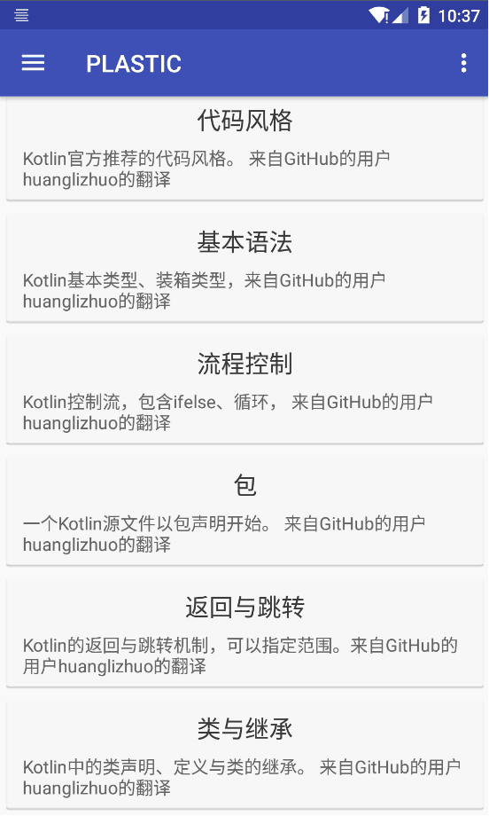

= PLASTIC APP =

:hardbreaks:
:toc:
:toc-placement!:

toc::[]

== What is this ==
这是什么

This is an Android App for learning of programming.
这是一款为编程学习打造的Android App。

You can see the screencut:
你可以看到截图：

=== Resource ===

https://github.com/huanglizhuo/kotlin-in-chinese[Kotlin docs Chinese]
Kotlin中文官方文档
https://github.com/huanglizhuo/kotlin-in-chinese/issues/18#issuecomment-230971017[Application]
申请权限

=== Build and deployment ===
构建与部署

clone and open it in your Android Studio.
克隆到本地并且使用你的Android Studio打开即可。

=== What was this ===
这曾经是什么

This is an social app for the https://github.com/ProgramLeague/[plastic club]
这曾经是一款为PLASTIC组织打造的社交App。

Actually this App will become a program learning App(I will publish some dialogs to the backend and you guys can read it)
懒得翻译了
